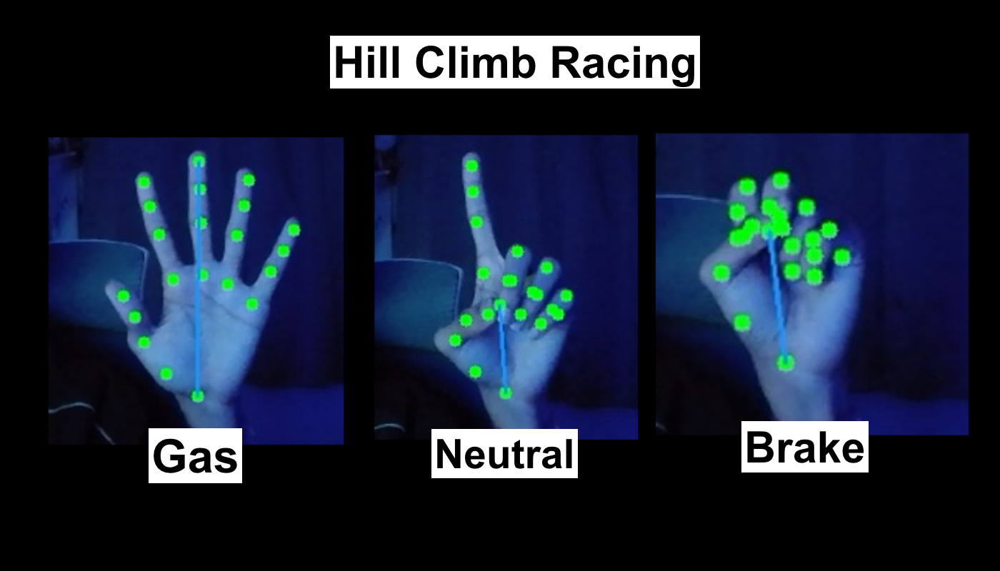
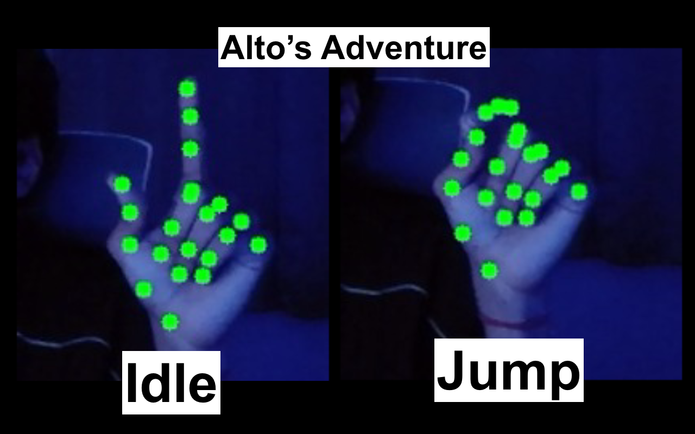

# 🏎️ AI Gesture Controller for Games
A real-time computer vision application that maps hand gestures to keyboard inputs. Built with OpenCV and MediaPipe to enable hands-free gameplay for Hill Climb Racing and Alto's Adventure.


Control your favorite games using real-time hand tracking! This project uses **OpenCV** and **MediaPipe** to translate hand gestures into keyboard inputs. It features specialized controllers for Hill Climb Racing and Alto's Adventure.

## 📁 Project Structure

1. **`hand_tracking_basic.py`** - The foundation script.  
   - Displays all 21 hand landmarks.  
   - Includes a "Dino Game" jump example.  
   - Prints landmark coordinates to the console for calibration.

2. **`hill_climb_racing.py`** - Optimized for pedal control.  
   - **Palm:** Gas (Right Arrow)  
   - **Fist:** Brake (Left Arrow)  
   - **Index Finger / No Hand:** Neutral (Coasting)
  
     

3. **`altos_adventure.py`** - Uses temporal (time-based) logic for complex moves.  
   - **Short Pinch:** Jump / Single Click.  
   - **Long Pinch:** Backflip / Long Press.
  
   
---


1. **Install requirements:** ```bash
   pip install -r requirements.txt
2. **Verify files**: Ensure hand_landmarker.task is in the folder.

3. **Run as Admin**: Right-click VS Code/Terminal and "Run as Administrator" (required for Microsoft Store games like Hill Climb Racing).

4. **Play**: - Use hand_tracking_basic.py to see your landmarks in action.
    Use hill_climb_racing.py or altos_adventure.py to play!

5. **Exit**: Press 'k' to quit any script.


## 🚀 Getting Started
### Prerequisites
- Python 3.8+
- A working webcam
- **Administrator Privileges:** Microsoft Store games (like Hill Climb Racing) require the script to run as an Admin to register keypresses.

### Installation
1. Clone the repo:
   ```bash
   git clone [https://github.com/nareshfr/gesture-controlled-gaming.git] (https://github.com/nareshfr/Ygesture-controlled-gaming.git)
